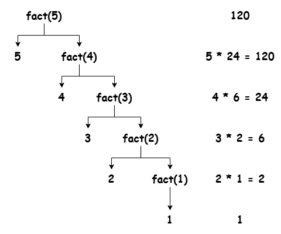

### Recursion

- Functions in C can call itself. This is called recursion.
- Functions calling itself is called recursive function.

#### Recursive Function

Base condition is important for recursive function, otherwise it goes into infinite loop.

```c
int fact(int n);

#include <stdio.h>

int main() {
    printf("Factorial: %d", fact(5));

    return 0;
}

int fact(int n) {
    // Base condition
    if(n == 1) {
        return 1;
    }

    return n * fact(n - 1);
}
```

This is the recursive function, the working of the recursive function is as follows:



#### Note

1. Recursion is often a direct way to impelement certain algorithms, but not always the most direct for every algorithm. <br />
    Particularly suited for problems that can be divided into smaller, similar sub-problems, but for some algorithms, iterative approaches might be more straightforward and efficient.

1. The condition in recursive function that stops further recursion is called the base case. <br />
    Prevents infinite recursion and functions terminates correctly.

1. Sometimes, recursive functions can run indefinitely causing stack overflow or memory error.

---