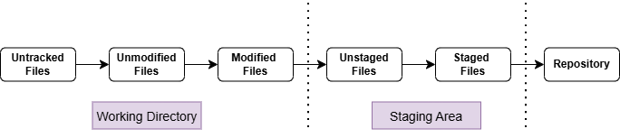

### Git

#### What is it?

- Open-source Distributed VCS
- Created by Linus Torvalds in 2005  

> _Linus Torvalds is also the creator of Linux._

#### Features

1. Collaboration
1. History Tracking
1. Branching and Merging
1. Distributed Development

#### Core Concepts

1. Repository / Repo
    - Storage place for project codebase and history
    - Two types:
        - Local Repo: project and history stored on a local system
        - Remote Repo: project and history hosted on server

1. Commits
    - Snapshot of project at a specific point in time
    - Allows to track changes, history and review code
    - Each commit has unique SHA-1 hash ID (40 character hexadecimal value), parent commit (reference to the previous commit), author information, timestamp and the commit message

> _The hexadecmial value is generated depending upon the content of the file and the message._

1. Branches
    - Separate line of development for bug fixes and feature development
    - _main_ or _master_ branch is the default branch

1. Merging
    - Integrating one branch into another branch
    - Branches can be merged back into the _main_ branch

1. Cloning
    - Creating a copy of the remote repo into a local system
    - Contains files, branches and commit history

1. Pull
    - Saving changes from remote repo into local repo

1. Push
    - Saving changes from local repo into remote repo

#### Workflow of Git

        

Git focuses mainly on three things:
1. Working Directory
    - Place where modifications to the files are done
    - Files can be new, modified or deleted
    - Modifications are not queued for being saved in the repo

1. Staging Area
    - Place where the modifications are queued for being saved in the repo
    - Also known as _index_

1. Repo
    - Place where modifications are reflected in the local repo

 

In this workflow, multiple files are involved and they are:
1. Untracked Files - Files in the working directory but not yet managed by Git
1. Unmodified Files/Tracked Files - File contents not changed but managed by Git
1. Modified Files - File contents are changed since last commit
1. Unstaged Files - File contents are changed and it's not queued for being saved in the repo
1. Staged Files - File contents are changed and it's queued for being saved in the repo
1. Files saved in the repo

---    