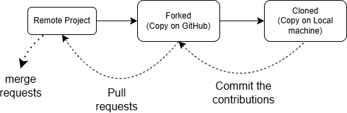

### Some Concepts in Git

#### Ignoring Files

- For ignoring files in Git, create a _.gitignore_ file in the repo
- List the files to be ignored in the _.gitignore_ file and the files will be ignored by Git
- Only untracked files are ignored by _.gitignore_ file
- The files are written in the following format:
    - folder-name/file-name
    - /*.extension
    - /file-name

#### For Tracking Empty Directories

- _.gitkeep_ is a conventional, non-official file used in Git repo to ensure that the empty directories are tracked and included in the commits
- Git by default tracks only files and does not track empty directories i.e. Git does not push the empty directories

#### Merging

Merging of branches = Joining of branches

1. Fast Forward Merge
    - Linear join between branches
    - Commits are made individually in either file other than main branch
    - There is no conflict between the commits and the merges
    - No commits are there in the main branch
    - HEAD points to both the branches
    - Move the new commit from child branch to the parent branch

    <p align="center">
        
    </p>

1. Squash Merge
    - Collapse the commits from one branch into a single new commit on the other branch

    <p align="center">
        
    </p>

1. Merge Commit
    - Apply the changes as a single new commit on the parent branch
    - Leave the child branch in the network for traceability

    <p align="center">
        
    </p>

#### Merge Conflicts

- Occurs when two developers make different commits on the same line of the code from different branches
- For resolving the merge conflict, we need to save the changes in the VS Code
- After saving the file in VS Code, the file must be staged and merge conflict is resolved

#### Forking & Cloning

- Used in open source contributions
- Forking &rarr; Creating copy of else's repo in our GitHub
- Cloning &rarr; Downloading the repo from GitHub to our local machine <br />

<p align="center">
    
</p>

#### Git Rebase

- Rebasing means moving or sequencing the commits mainly used for feature development
- It's like rewriting the history
- Cutting the commit and then pasting it on top other commits
- Rebasing other branch on main branch combines the commits from the main branch with that other branch
- The commits are combined in that branch only and not in the main branch
- That's why merging is done for making the commits visible on the main branch also
- For example, <br />
    main: A &rarr; B <br />
    feature: A &rarr; B &rarr; C &rarr; D <br />
    main: A &rarr; B &rarr; E &rarr; F <br />
    <br />
    ```git merge``` (Useful for working in teams) <br />
    &emsp; &emsp; &emsp; &emsp; A &rarr; B &rarr; E &rarr; F <br />
    &emsp; &emsp; &emsp; &emsp; &emsp; &emsp; &ensp; &ensp; &vert; &emsp; &vert; <br />
    &emsp; &emsp; &emsp; &emsp; &emsp; &emsp; &emsp; C &rarr; D &rarr; M (merge commit)<br />
    <br />
    ```git rebase``` (Used for working alone, to clean history/linear history) <br />
    &emsp; &emsp; &emsp; &emsp; A &rarr; B &rarr; E &rarr; F &rarr; C' &rarr; D'<br />
    &emsp; &emsp; &emsp; &emsp; [Copyting after main] <br />
    &emsp; &emsp; &emsp; &emsp; Then we can merge

---