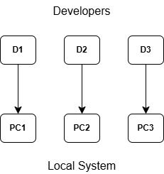
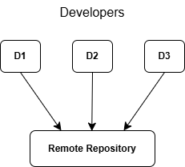
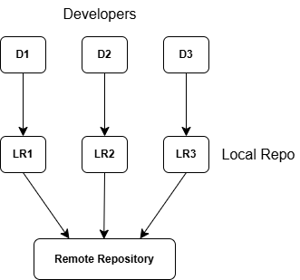

### Version Control System

#### What is it?

- Tool used to track and manage changes in the project's codebase
- Also known as **Software Configuration Management (SCM)** system

#### Features

1. Track changes over time
1. Collaboration
1. Code History and Audit Trails
1. Backup and Recovery
1. Branching and Merging

#### Types of Version Control System

1. Local Version Control System
    - Project codebase is on local system
    - No remote repo and collaboration
    
    

        
    

1. Centralized Version Control System
    - Has a central remote repo
    - Shared with the other developers
    - Commits are directly made to the remote repo
    - Knowingly or unknowingly the files may get affected

    

        
    

1. Distributed Version Control System
    - Both local and remote repo are present
    - Developer works on the local repo
    - Updates are pushed from local to the remote repo

    

        
    

---